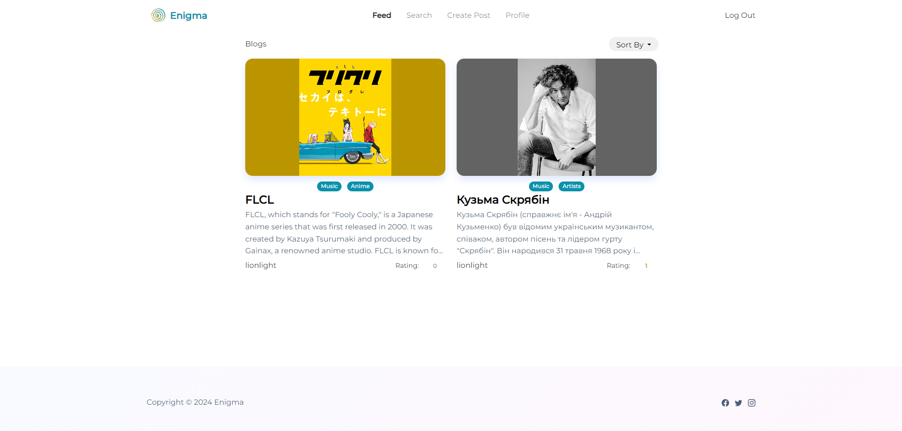
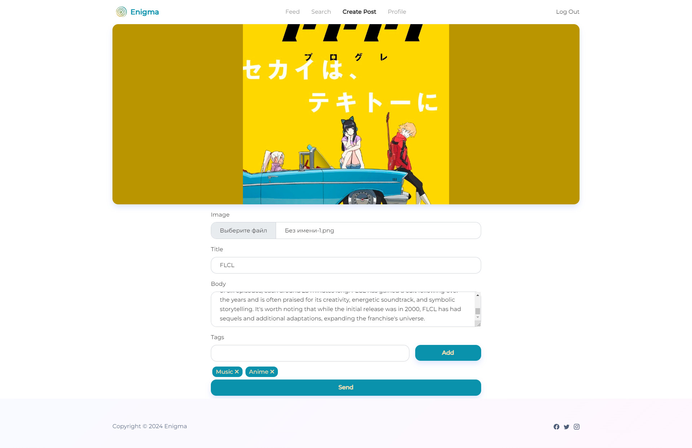
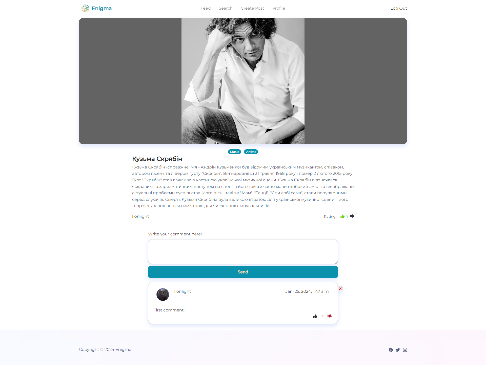
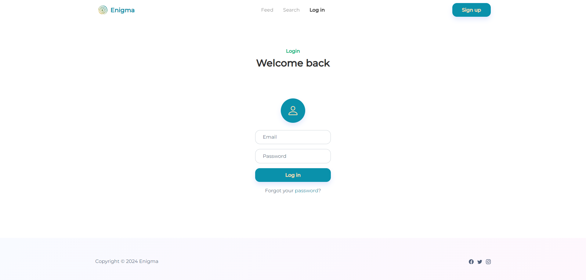
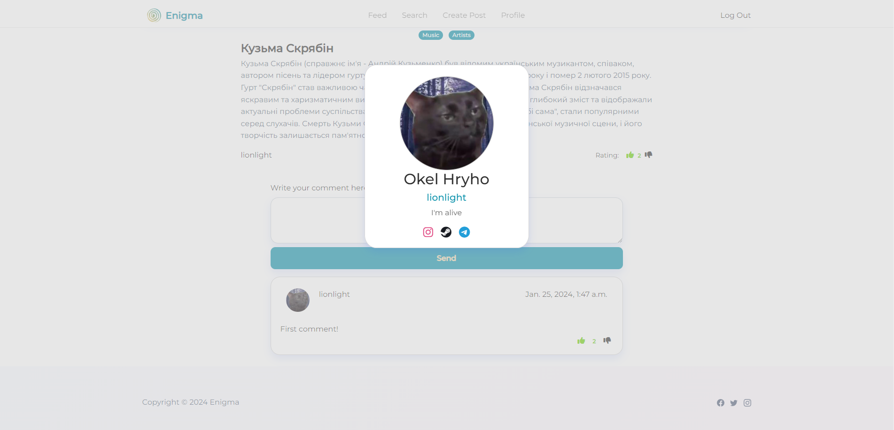
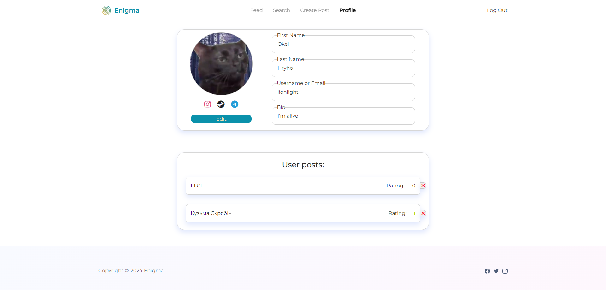

#  Project Enigma

Django-based blog site

## Installation

Create .env file in the root of the project where manage.py is located and set the following variables:
(Without DJANGO_DEBUG=True static files will not be loaded)

```properties
EMAIL_SYSTEM_EMAIL="your@email.com"
EMAIL_SYSTEM_PASSWORD="your_password"
SECRET_KEY="secret_key"
DJANGO_DEBUG=True
```

These variables are optional, but EMAIL_SYSTEM_EMAIL and EMAIL_SYSTEM_PASSWORD is required for password restore
functionality. Email system should work only for GMail with
created [password for specific app](https://support.google.com/accounts/answer/185833).

### Install python requirements:

```shell
pip install -r requirements.txt
```

Migrate database
```shell
python manage.py migrate
```

And finally, run the server.

```shell
python manage.py runserver
```

## Example images:

#### Main page



#### Create Post page



#### Post page



#### Login page



#### Mini profile



#### Profile page



